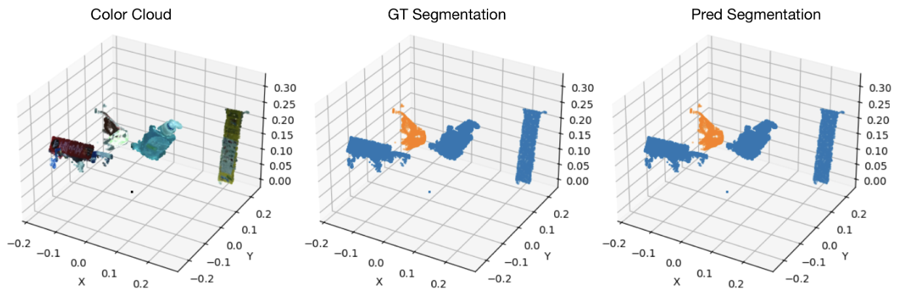
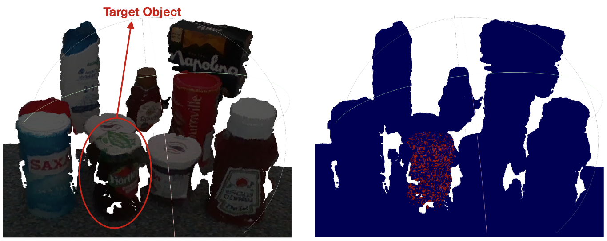
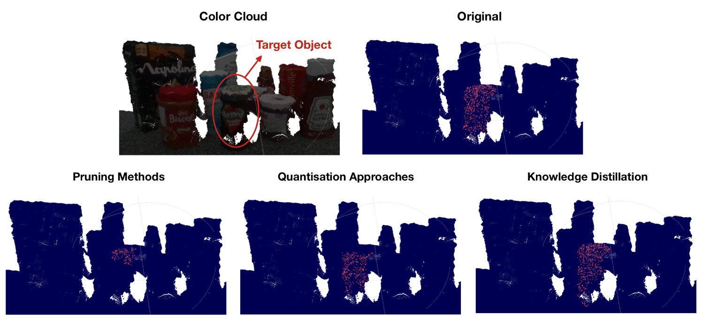

# PointWeb (PyTorch) — MiniMarket Semantic Segmentation

PointWeb implemented in PyTorch for 3D point‑cloud **semantic segmentation** (object vs. background) on MiniMarket‑style scenes. Train on HDF5 datasets and run inference on raw `.pcd` scenes.

---

## Quick Start

### 1) Environment
Create and activate the conda environment from the provided YAML:

```bash
# clone the repo
git clone https://github.com/Saravut-Lin/pointweb.git
cd pointweb

# create and activate the environment
conda env create -f pointweb_env.yml
conda activate pointweb   # or the name defined inside the YAML
```

---

### 2) Dataset
Generate the dataset using the **MiniMarket dataset processing** repo, then copy the produced HDF5 into this repo’s `dataset/market77/` folder.

```bash
git clone https://github.com/msorour/MiniMarket_dataset_processing.git
cd MiniMarket_dataset_processing
# Follow that repo's instructions to produce the .h5 /.hdf5 file
```

Place the generated file here:

```text
pointweb/
└─ dataset/
   └─ market77/
      └─ jam_hartleys_strawberry_300gm_1200_2048_segmentation_20480_12000   # ← your generated file (name is up to you)
```

> If you use a different path/filename, adjust the corresponding argument or constant in the training/inference scripts.

---

### 3) Train
Run the MiniMarket semantic‑segmentation training (shell wrapper calls `tool/train.py` under the hood):

```bash
sh tool/train.sh market pointweb
# optional: view/edit options inside tool/train.sh
```

The script logs metrics and saves checkpoints; **note the best checkpoint path** (e.g., best epoch around 27 in our runs).

---

### 4) Inference on real‑world scenes (`.pcd`)
Use your saved checkpoint to run inference on a PCD file. Example PCDs live under **`segmentation/realworld_scene/`**.

```bash
python segmentation/inference.py
# optional: `python segmentation/inference.py -h` for flags
```

The inference utility removes invalid/NaN points, can chunk large clouds with voting, and writes/visualizes the predicted segmentation (object vs. background).

---

### 5) Compression (Pruning / Quantisation / Knowledge Distillation)
Train the compressed variants using the provided scripts:

```bash
# Pruning
sh tool/train_prune.sh market pointweb

# Quantisation
sh tool/train_quant.sh market pointweb

# Knowledge Distillation (configured via the same script)
sh tool/train_quant.sh market pointweb
```

> Each script writes its own checkpoints; use those paths with the same inference command shown above.

---

## Results

### Training performance
- After a 10‑epoch warm‑up the training loss fell below **0.02** and oscillated around **~0.01**.
- Point‑wise accuracy saturated at **≥ 99.8%**.
- Best mean **mIoU = 0.991** at **epoch 27** with balanced class accuracies above **99.8%**.
- Adaptive Feature Adjustment layers exchange dense local context without destabilising optimisation.

**Qualitative test example (epoch 27)** — object (orange) vs. background (blue):



### Validation performance
- Validation mIoU improved from **0.847 → 0.986** at **epoch 27**; overall accuracy rose to **~99.75%**.
- Class IoU: background **0.961 → 0.997**, object **0.733 → 0.975**, mitigating class imbalance in MiniMarket‑77.
- Early‑stopping halted at **epoch 52** when no further mIoU gains appeared for 25 epochs; the final stored checkpoint still delivers **≥ 97%** accuracy.
- Train–val accuracy gap stayed **< 0.002**, indicating minimal over‑fitting.

### Real‑world PCD inference
- Grid‑partition with voting yields fast runtime: **mean 1.91 s** over 10 PCDs (range **1.69–2.61 s**).
- The predicted mask forms a single, compact component aligned with the target object; crisp vertical boundaries and clear separation from neighbouring bottles.
- Minor artefacts: a few internal pin‑holes on shiny/sparsely sampled regions and slight trimming at the base; **negligible false positives**.
- **Meets the qualitative pass criterion** by isolating the target cleanly with only small internal holes.



---

## Model Compression Results



**Summary**
- **Pruning**: ~**1.81 s** mean latency (vs. 1.91 s baseline) → **~5.1%** faster; segmentation quality preserved with only minor boundary erosion.
- **Quantisation**: ~**1.77 s** mean latency → **~7.3%** faster; clean target localisation, slight boundary thinning.
- **Knowledge Distillation**: ~**1.78 s** mean latency → **~6.8%** faster; near‑best runtime with clean masks.

All three compression methods preserved segmentation quality on our setup while providing modest speed‑ups.

---

## Repository Layout

```text
pointweb/
├─ tool/
│  ├─ train.sh                 # training entry point (MiniMarket semantic segmentation)
│  ├─ train_prune.sh           # pruning training
│  ├─ train_quant.sh           # quantisation training (and KD, as configured)
├─ segmentation/
│  ├─ inference.py             # inference on real-world PCDs
│  └─ realworld_scene/         # example PCD scenes for inference
├─ dataset/
│  └─ market77/                # place your generated HDF5 file here
├─ checkpoints/                # (optional) saved models
├─ pointweb_env.yml            # conda environment
└─ figure/                     # figures used in this README
```

---

## Tips & Troubleshooting
- **CUDA / memory:** reduce batch size `k` if you hit OOM.
- **PCD ingest:** ensure `.pcd` files are valid; the inference script removes invalid points but cannot fix corrupted files.
- **Paths:** double‑check dataset and checkpoint paths and CLI arguments.
- **Scripts:** Review the shell scripts in `tool/` to adjust epochs, LR, and other hyper‑parameters.

---

## Acknowledgments
- **Model:** PointWeb — Enhancing Local Neighborhood Features for Point Cloud Processing (Zhao *et al.*, CVPR 2019).
- **Dataset preparation:** [MiniMarket_dataset_processing](https://github.com/msorour/MiniMarket_dataset_processing).

---

## License
See the repository’s `LICENSE` file.

---

## Citation
If you use this code or results, please cite:

```bibtex
@inproceedings{zhao2019pointweb,
  title     = {PointWeb: Enhancing Local Neighborhood Features for Point Cloud Processing},
  author    = {Zhao, Hengshuang and Jiang, Li and Fu, Chi-Wing and Jia, Jiaya},
  booktitle = {Proceedings of the IEEE/CVF Conference on Computer Vision and Pattern Recognition (CVPR)},
  year      = {2019}
}
```

---

## Reproduction checklist
- [x] `conda env create -f pointweb_env.yml && conda activate pointweb`
- [x] Generate HDF5 with `MiniMarket_dataset_processing` → place in `./dataset/market77/`
- [x] `sh tool/train.sh market pointweb` → note best checkpoint (e.g., epoch 27)
- [x] `python segmentation/inference.py --ckpt <best.pth> --pcd segmentation/realworld_scene/<scene>.pcd`
- [x] Train compressed variants: prune / quant / KD via `tool/` scripts
